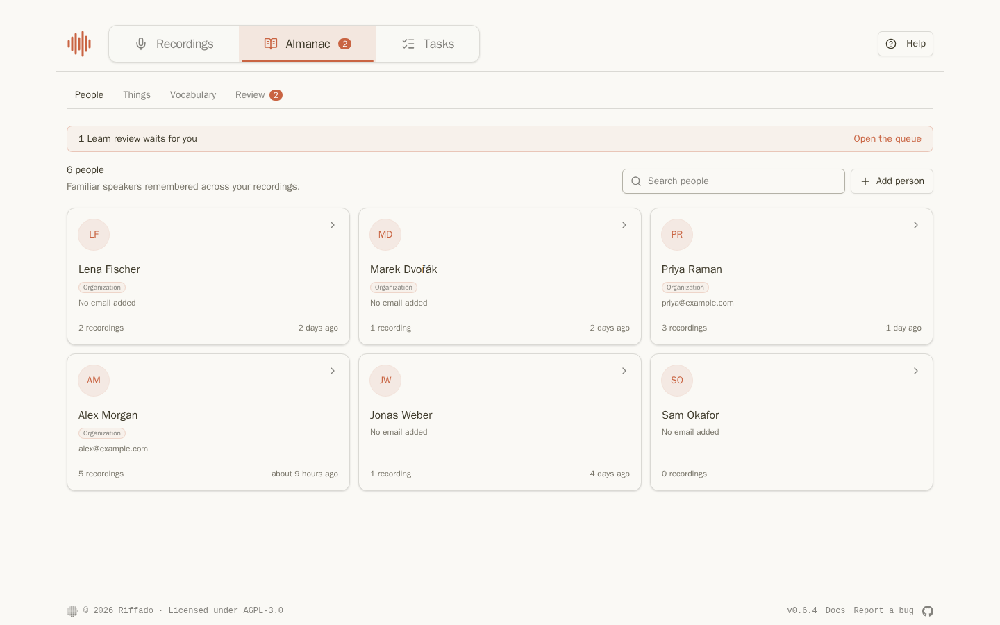
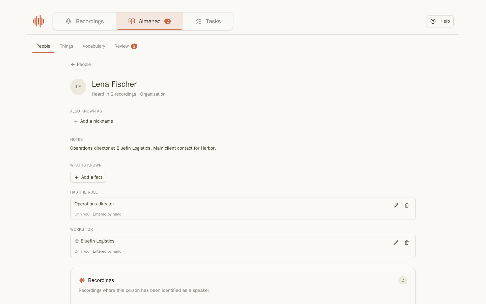
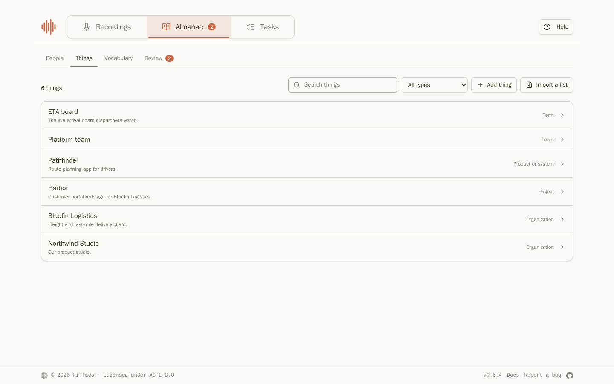
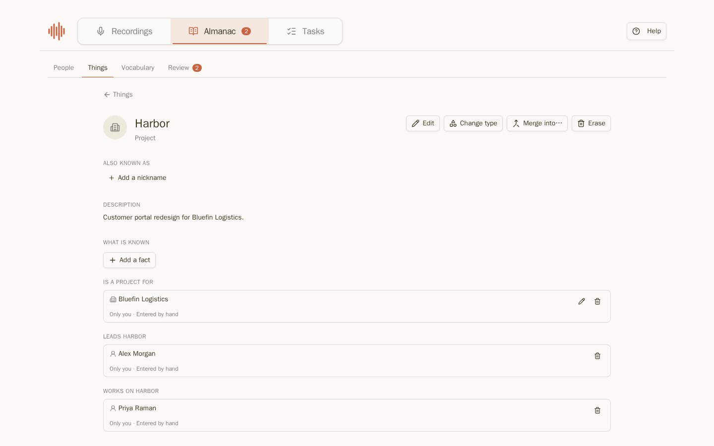
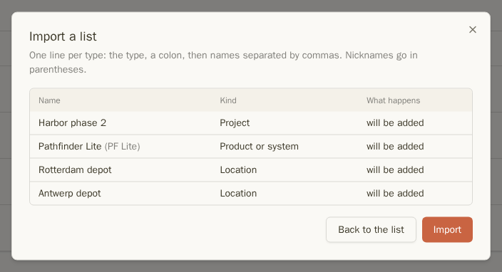
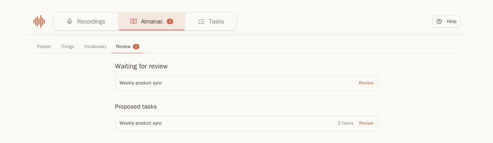

Almanach obsahuje vše, co Riffado ví o lidech a věcech, o kterých Vaše nahrávky hovoří: kdo je kdo, na čem kdo pracuje, jak se jmenuje projekt a jak bývá často špatně rozuměn. Přepis, Naučit se, souhrny a úkoly z něj vycházejí.

Obsahuje čtyři karty: **Lidé**, **Věci**, **Slovník** a **Revize**.

<span id="people" />

## Lidé



Každý, koho jste pojmenovali jako řečníka, je zde, včetně počtu nahrávek, ve kterých je slyšet. **Přidat osobu** umožní přidat někoho ještě před tím, než promluví. Lidé označení jako **Organizace** pocházejí z nahrávek sdílených s Organizací (viz [Organizace](organization.md)).

Kliknutím na osobu otevřete její stránku:



- **Také známý jako**: přezdívky a jiné varianty jmen. Vyhledávání podle nich osobu najde a Naučit se je rozpoznává v přepisech.
- **Poznámky**: cokoli si chcete zapamatovat. U organizačních osob jsou poznámky Vaše vlastní.
- **Co je známo**: fakta jako *pracuje pro Bluefin Logistics* nebo *má roli Operations director*. **Přidat faktum** umožní zvolit vztah a druhou stranu z Almanachu, nebo použít prostý text. Riffado odmítá fakta o zdraví, rodině, osobnosti, výkonnosti nebo demografii.
- **Nahrávky**: kde tato osoba mluví.
- **To jsem já** určuje Riffadu, která osoba jste Vy. Naučit se pak ví, kdo nahrávku vytvořil, a Vaše úkoly se zobrazují pod záložkou **Moje**.
- **Přejmenovat**, **Sloučit do…** (pokud dvě položky představují tutéž osobu) a **Smazat**.

<span id="things" />

## Věci



Věci jsou organizace, týmy, projekty, produkty, pojmy, lokality a dokumenty. Můžete je vyhledat, filtrovat podle typu, nebo kliknout na **Přidat věc**.



Stránka věci má stejné části jako stránka osoby: přezdívky, popis, fakta a nahrávky, s možnostmi **Upravit**, **Změnit typ**, **Sloučit do…** a **Smazat**.

<span id="importing-a-list" />

### Import seznamu

Volba **Importovat seznam** na kartě Věci umožňuje přidat více názvů najednou. Napište každý typ na samostatný řádek: typ, dvojtečka a názvy oddělené čárkou, přičemž přezdívky uveďte v závorkách:

```
project: Harbor phase 2
product: Pathfinder Lite (PF Lite)
location: Rotterdam depot, Antwerp depot
```

Kliknutím na **Náhled** se zobrazí, co bude přidáno, než cokoliv uložíte:



<span id="vocabulary" />

## Slovník

**Slovník** zobrazuje druhy věcí a vztahů, které jste vytvořili nad rámec základních. Zde je můžete spravovat—ponechat, přejmenovat, sloučit nebo smazat. V Organizaci zde účet organizace rozhoduje o vztazích, které navrhli členové.

<span id="review" />

## Revize



**Revize** shromažďuje vše, co čeká na Vaše posouzení: [Naučit se](learn.md) běžící k revizi a [navržené úkoly](summaries-and-tasks.md#tasks-from-a-summary) k potvrzení. Odznak na **Almanachu** je počítá.

Dále: [Naučit se](learn.md)
