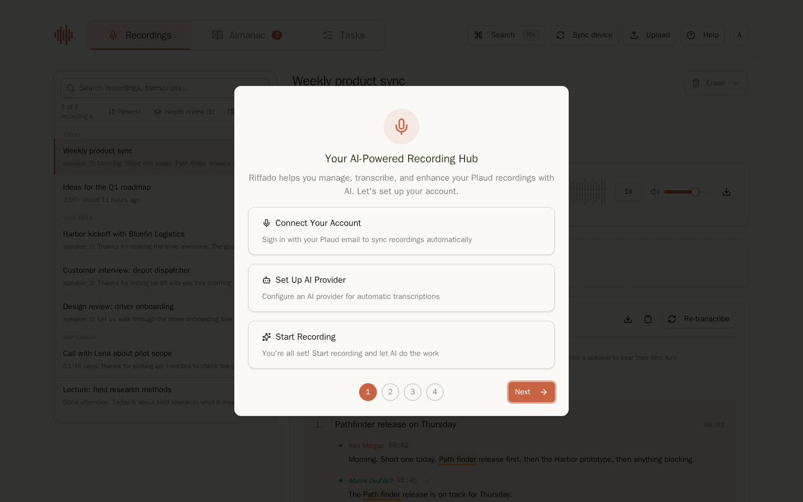
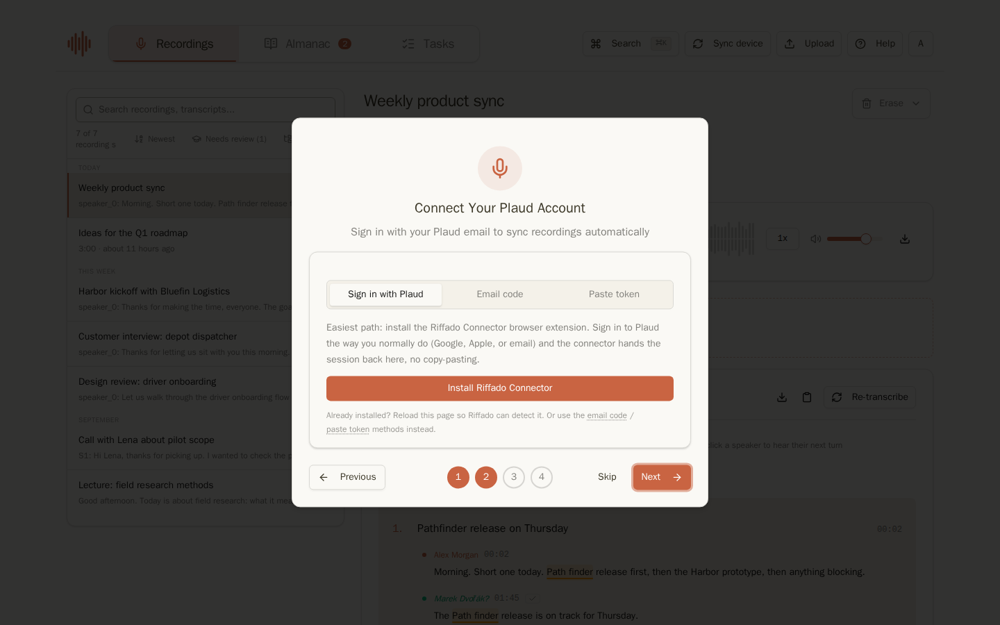
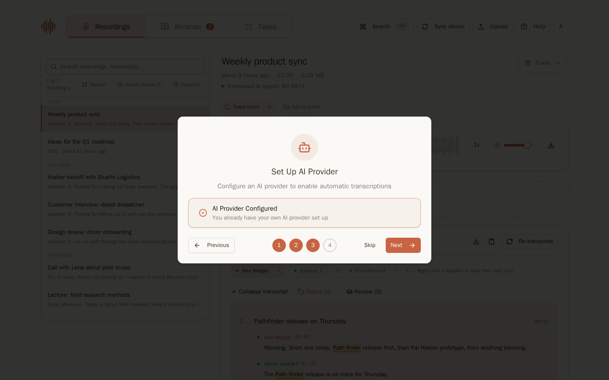
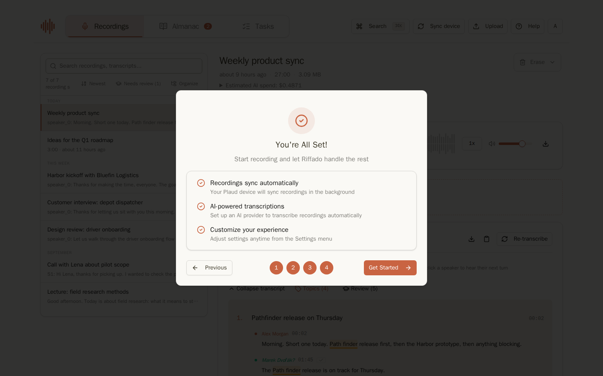
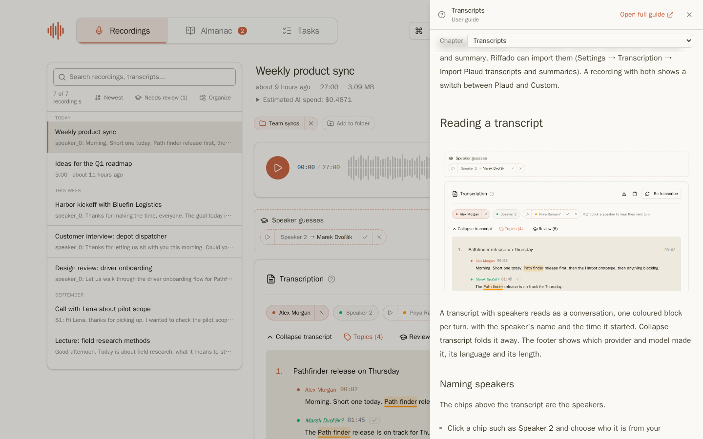
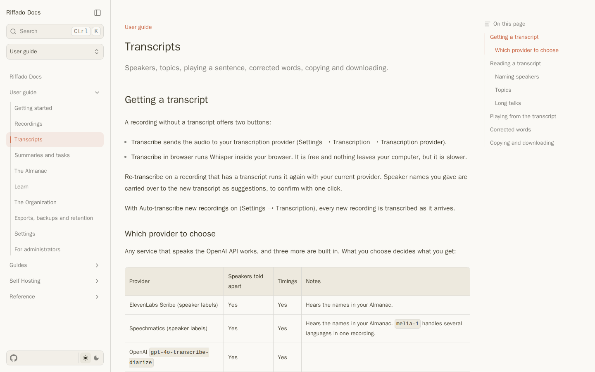
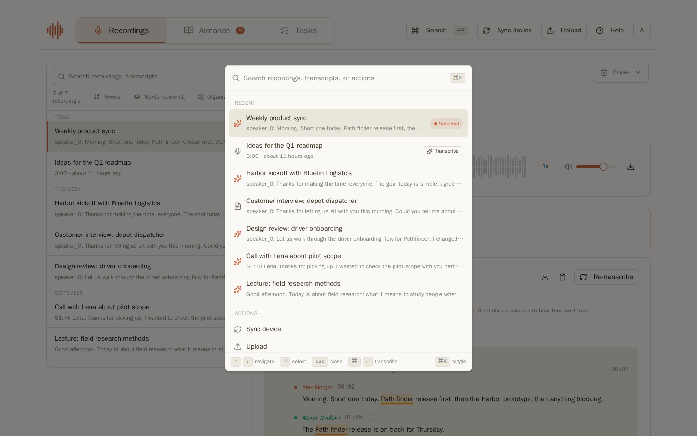

## Přihlášení

Otevřete svou adresu Riffado v prohlížeči a přihlaste se pomocí svého e-mailu a hesla. Na nové instanci s vlastním hostingem se první zaregistrovaný účet stává administrátorem.

Pokud vaše organizace používá jednotné přihlašování, na přihlašovací obrazovce se místo toho zobrazí jedno tlačítko, například **Přihlásit se přes Keycloak**. Váš účet se vytvoří při prvním přihlášení. Registrace může být na vaší instanci uzavřená; v tom případě požádejte svého administrátora o přístup.

## Průvodce prvním spuštěním

Při prvním otevření Riffado vám krátký průvodce pomůže nastavit základní věci. Jakýkoliv krok můžete přeskočit a vrátit se k němu později v Nastavení.

| Krok | Co dělá |
| --- | --- |
|  | **Vítejte.** Co Riffado umí: synchronizuje nahrávky, přepisuje je a pomocí AI je shrnuje. |
|  | **Připojte účet nahrávače.** Přihlaste se rozšířením prohlížeče Riffado Connector, pomocí kódu zaslaného e-mailem nebo vložením tokenu. Poté Riffado začíná pravidelně stahovat vaše nahrávky. |
|  | **Nastavte poskytovatele AI.** Otevře Nastavení, kde přidáte službu pro přepisy a shrnutí. Viz [Poskytovatelé AI](settings.md#ai-providers). |
|  | **Vše je připraveno.** Klikněte na **Začít**. |

Pro zobrazení průvodce znovu přejděte do **Nastavení → Export/Záloha** a klikněte na **Znovu spustit úvodní nastavení**.

## Orientace v prostředí

Horní lišta obsahuje tři sekce:

- **Nahrávky**: vaše knihovna. Vlevo je seznam nahrávek, vpravo detail vybrané nahrávky.
- **Almanach**: osoby a objekty, o kterých Riffado ví. Odznak ukazuje počet recenzí čekajících na vás. Viz [Almanach](almanac.md).
- **Úkoly**: akční položky nalezené ve vašich nahrávkách. Odznak ukazuje nové úkoly přiřazené vám. Viz [Shrnutí a úkoly](summaries-and-tasks.md#the-tasks-page).

Vpravo v liště:

- **Hledat** (nebo `Ctrl`/`⌘` + `K`) otevře příkazovou paletu.
- **Synchronizovat zařízení** okamžitě stáhne nové nahrávky z cloudu vašeho nahrávače, místo čekání na další automatickou synchronizaci.
- **Nahrát** přidá zvukový nebo video soubor z vašeho počítače.
- Kulaté tlačítko s vaším iniciálou otevře nabídku účtu: **Nastavení**, **Klávesové zkratky**, režim světlý/tmavý a **Odhlásit se**.

## Získání pomoci

Klikněte na **Nápověda** v horní liště nebo stiskněte `h` pro otevření této příručky vedle vaší práce, v kapitole týkající se aktuální obrazovky. Na stránce nahrávky se otevře [Přepisy](transcripts.md), na stránce Úkoly [Stránka Úkoly](summaries-and-tasks.md#the-tasks-page), v Nastavení se otevře právě zvolená sekce.

- **Kapitola** nahoře v panelu umožňuje přepnout na jinou kapitolu.
- **Otevřít celou příručku** otevře stejnou stránku v nové záložce s navigací a vyhledáváním.
- Malé **?** u některých funkcí, například na kartách Přepis a Shrnutí, v recenzi Učit se nebo u nastavení exportu složek, otevře panel přímo u této funkce.

Celá příručka je také dostupná na `/docs` na vaší adrese Riffado v sekci **Uživatelská příručka**.

## Příkazová paleta

Paleta během psaní vyhledává v názvech i přepisech. Stiskněte `Enter` pro otevření nahrávky, nebo `⌘` + `Enter` pro přepis nahrávky, která ještě nemá přepis. Umí také spustit akce jako **Synchronizovat zařízení**, **Nahrát** nebo **Otevřít nastavení**.

## Klávesové zkratky

| Klávesy | Akce |
| --- | --- |
| `⌘`/`Ctrl` + `K` | Příkazová paleta |
| `?` | Seznam zkratek |
| `h` | Otevřít tuto příručku na aktuální obrazovce |
| `,` | Nastavení |
| `/` | Hledat v seznamu nahrávek |
| `j` / `k` | Další / předchozí nahrávka |
| `Space` | Přehrát nebo pozastavit |
| `←` / `→` | Posun zpět / vpřed o 5 vteřin |
| `↑` / `↓` | Hlasitost |

## Jazyk

Riffado komunikuje anglicky i česky. Řídí se jazykem vašeho prohlížeče, dokud si v **Nastavení → Zobrazení → Jazyk** nezvolíte jiný. E-maily, které vám Riffado zasílá, se také posílají ve stejném jazyce.

Pokračujte: [Nahrávky](recordings.md)
