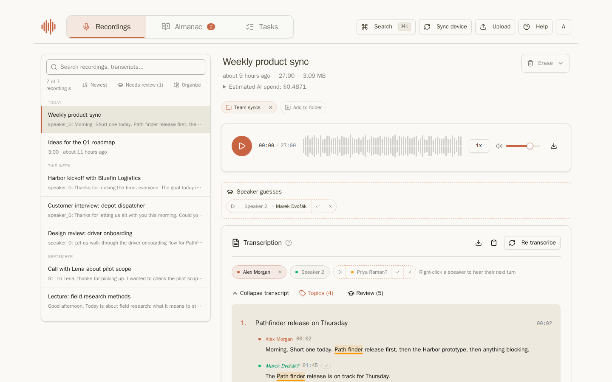

Riffado keeps your voice recordings, turns them into transcripts and summaries with the AI provider you choose, and remembers the people and things they talk about. This guide walks through everything you can do in the app, one screen at a time.

Every screenshot shows the same invented team: **Alex Morgan**, a product lead at Northwind Studio, working with the client **Bluefin Logistics** on a project called **Harbor**. None of the people or companies are real.

## Chapters

1. [Getting started](getting-started.md): signing in, the first-run wizard, finding your way around.
2. [Recordings](recordings.md): the recording list, the player, uploads, folders, erasing, and what the AI cost.
3. [Transcripts](transcripts.md): speakers, topics, playing a sentence, corrected words, copying and downloading.
4. [Summaries and tasks](summaries-and-tasks.md): summaries, templates, multi-pass, and the tasks a summary finds.
5. [The Almanac](almanac.md): the people and things Riffado knows, their nicknames and facts.
6. [Learn](learn.md): let Riffado propose speaker names, corrections and facts, and review them.
7. [The Organization](organization.md): sharing recordings with your colleagues.
8. [Exports, backups and retention](exports-backups-retention.md): folder exports to disk or Google Drive, backups, and deleting old data automatically.
9. [Settings](settings.md): AI providers and prices, transcription, topics, Learn, summaries, language and more.
10. [Riffado in Claude](claude.md): asking Claude or Claude Code about your recordings, people and tasks.
11. [For administrators](administrators.md): what to switch on for each feature on a self-hosted instance.

## Where a feature comes from

Some features depend on how your instance is set up. When a chapter describes one of these, it says so:

- **Learn** works on self-hosted instances with an AI provider that can write summaries.
- **The Organization** appears when the administrator has created the organization account.
- **Folder exports** to disk or Google Drive appear when the administrator has configured them.
- **Single sign-on** replaces the email and password form when the administrator has connected an identity provider.
- **Riffado in Claude** works when the administrator has turned on the MCP server and set up the Claude connector.

[For administrators](administrators.md) lists the switches.

## Updating the screenshots

The screenshots are made from demo data kept in this repository, so they can be retaken after the app changes. See `docs/user-guide/demo/README.md` in the repository.
