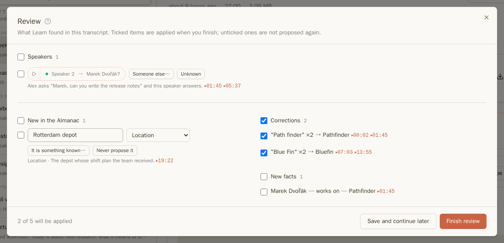
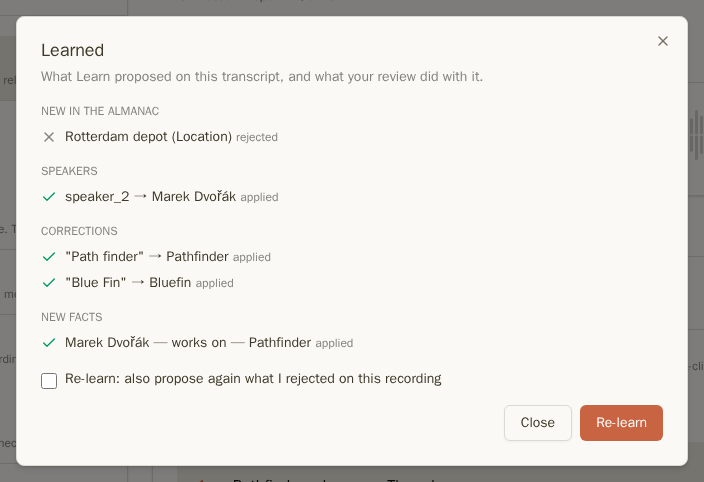

Funkce Učení porovnává přepis s vaším [Almanachem](almanac.md) a navrhuje nalezené položky:

- **jména mluvčích** pro ty, kteří zatím nebyli pojmenováni,
- **opravy** jmen, která přepis nesprávně rozpoznal („Path finder“ místo Pathfinder),
- **nové osoby a věci**, které stojí za to přidat do Almanachu,
- **fakta**, která byla řečena („Marek pracuje na Pathfinderu”).

Nic se nezmění, dokud návrhy nezkontrolujete.

Učení je dostupné u přepisů s časovými údaji na instancích s vlastním hostingem a poskytovatelem AI, který umí vytvářet souhrny (viz [Jakého poskytovatele zvolit](transcripts.md#which-provider-to-choose)).

## Spuštění Učení

Klikněte na **Učit se** nad přepisem. Tlačítko ukazuje průběh:

| Tlačítko         | Význam |
| ---                 | --- |
| **Probíhá učení…**    | Učení právě čte přepis. Stránku můžete opustit. |
| **Ke kontrole (5)**   | Čeká na Vás pět návrhů. |
| **Zkontrolováno (4)** | Přehled jste prošli; čtyři návrhy byly použity. Kliknutím zjistíte výsledek každého z nich. |
| **Zkontrolováno: nic nového** | Nic k navržení nebylo nalezeno. |
| **Chyba učení**            | Něco se nepovedlo; klikněte pro důvod a opakování.|

Při zapnutí **Učit se automaticky** (Nastavení → Učení) se Učení spustí u každého nového přepisu. Název, souhrn a témata pak čekají, až návrhy zkontrolujete, aby mohly vzniknout z upraveného přepisu. Čekají maximálně 72 hodin.

## Kontrola návrhů

Klikněte na **Ke kontrole** pro otevření přehledu:

- **Mluvčí**: koho Učení považuje za každého nepojmenovaného mluvčího a proč. **▷** přehraje důkaz. **Někdo jiný…** vybere jinou osobu, **Neznámý** označí mluvčího za neznámého.
- **Nové v Almanachu**: osoby a věci, které Učení rozpoznalo, ale Almanach je nezná. Začínají nezaškrtnuté. Opravte jméno nebo typ před zaškrtnutím, zvolte **Je to něco známého…**, pokud záznam už máte pod jiným jménem, nebo **Nikdy nenavrhovat**, pokud jej nechcete navrhovat v žádné nahrávce.
- **Opravy**: špatně rozpoznaná jména, četnost a výskyt. Tyto návrhy jsou předem zaškrtnuté.
- **Nová fakta** a **Známá fakta** zmiňovaná znovu.

Zaškrtněte, co je správně, a klikněte na **Dokončit kontrolu**. **Uložit a pokračovat později** zachová Vaše zaškrtnutí bez použití změn. Nezaškrtnuté návrhy již na této nahrávce nebudou navrženy.

Přehled nemusíte otevírat: návrhy se zobrazují i přímo v přepisu. Návrh opravy je zvýrazněn, navržený mluvčí je zobrazen jako jméno s **?**, každý s fajfkou k přijetí. **Návrhy mluvčích** nad přepisem zobrazují navržená jména s možností **Přijmout vše**.

## Po kontrole

Klikněte na **Zkontrolováno** a zobrazte výsledek každého návrhu: použit, zamítnut, nebo důvod přeskočení. **Učit se znovu** spustí Učení znovu; zaškrtněte **zopakovat i odmítnuté návrhy**, pokud jste si některý rozmysleli.

Přijaté opravy jsou uchovány vedle původního textu, nikdy ne místo něj, takže je lze vždy vrátit zpět. Viz [Opravená slova](transcripts.md#corrected-words).

Při zapnutí **Opravit přepis po Učení** (Nastavení → Učení, ve výchozím stavu zapnuto) pak Učení ještě jednou přečte celý přepis s údaji z Almanachu a opraví další nesprávně rozpoznaná slova. Každá oprava je podtržena jantarovou barvou a můžete ji vrátit zpět.

## Kde čekají kontroly

- Filtr **Vyžaduje kontrolu** nad seznamem nahrávek.
- Odznak na **Almanach** a záložka **Ke kontrole** tamtéž.
- Nahrávku s nedokončenou kontrolou nelze sdílet s Organizací, dokud není kontrola dokončena.

## Důležité vědět

- Jména jsou rozpoznávána v jejich ohýbaných tvarech v jazyce přepisu, s diakritikou i bez: „Šimákem“ najde Šimáka.
- Mluvčí označený pouze křestním jménem je podle toho označen. Křestní jméno, které sdílí dvě osoby v Almanachu, nepřiřadí žádné z nich.
- Zařazení nového záznamu jako toho, který už máte, naučí Riffado nerozpoznané jméno jako přezdívku, takže příští běh jej rozpozná správně.
- Učení může používat vlastního poskytovatele a model, například výkonnější než ten pro souhrny: Nastavení → Učení → **Poskytovatel učení**.

Pokračujte zde: [Organizace](organization.md)
