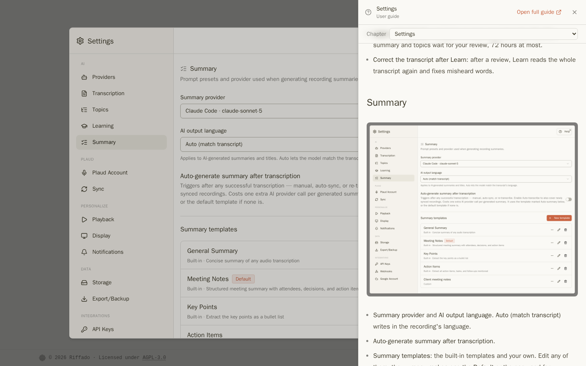
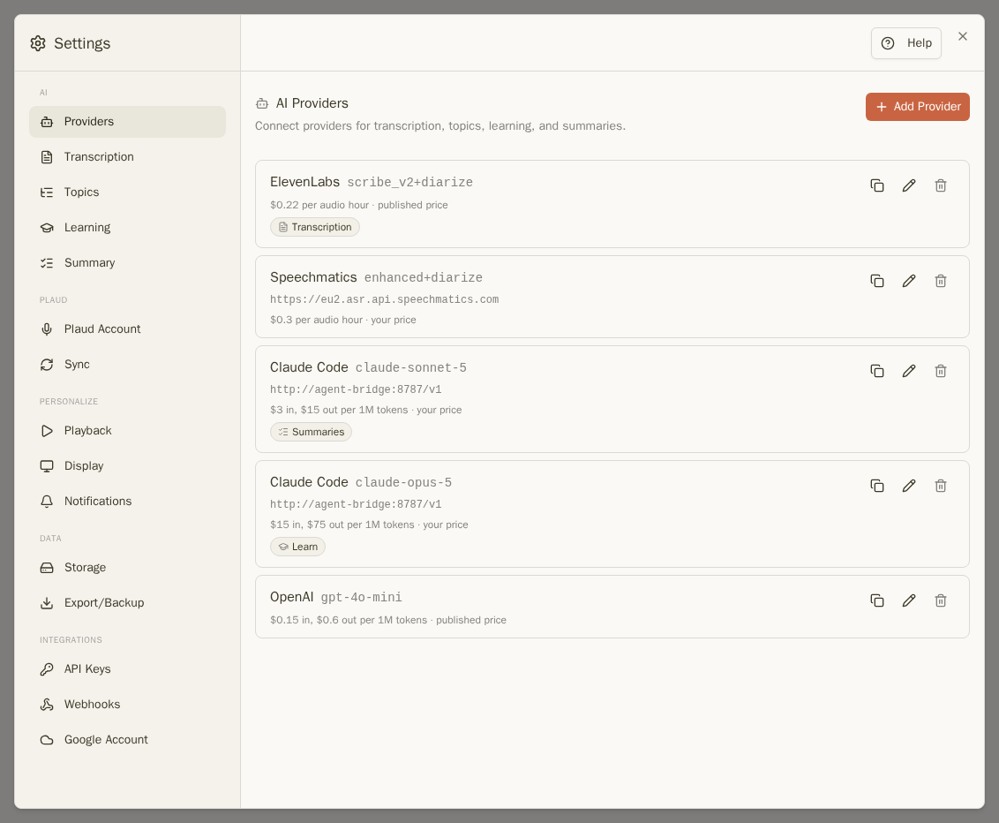
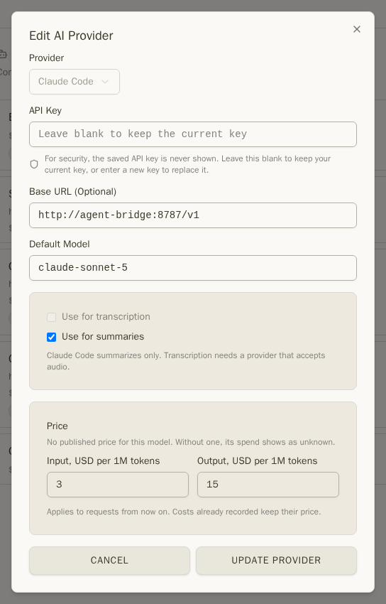
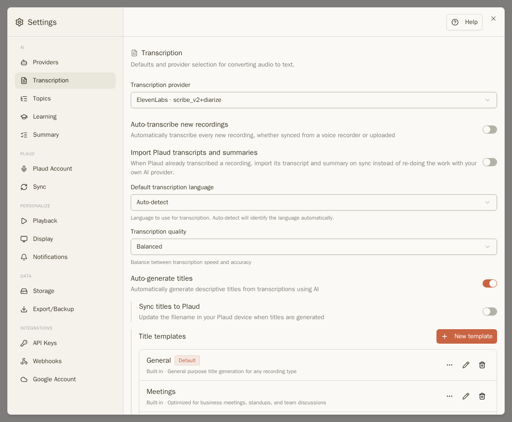
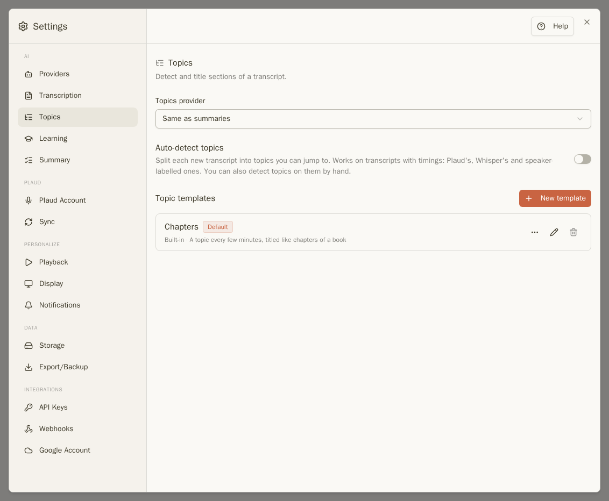
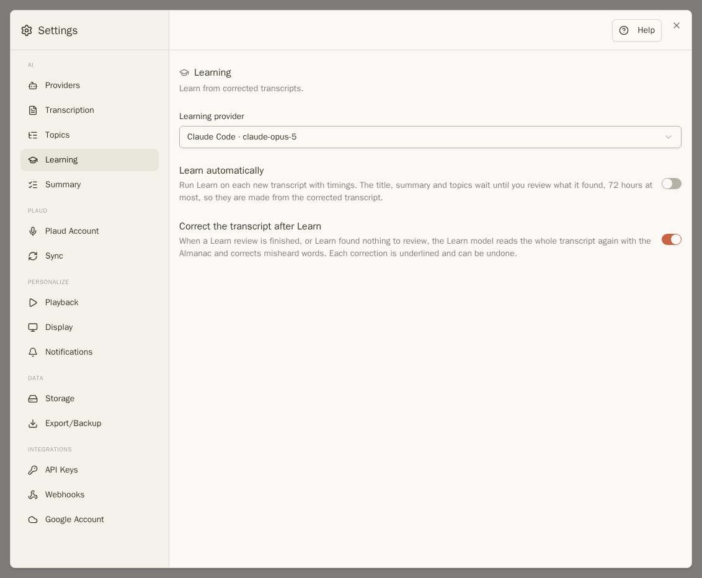
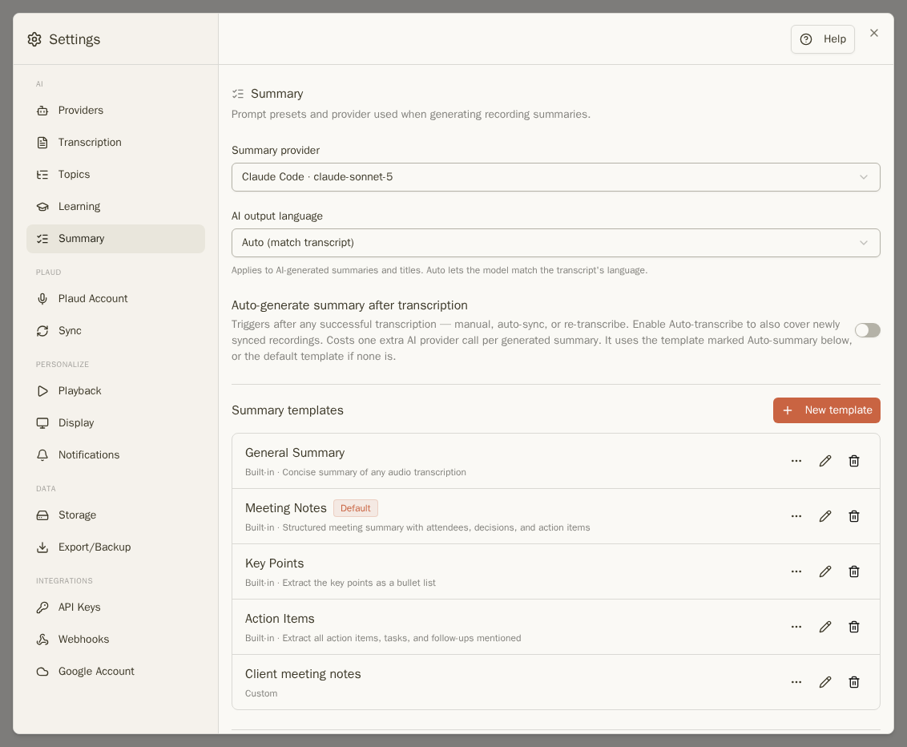
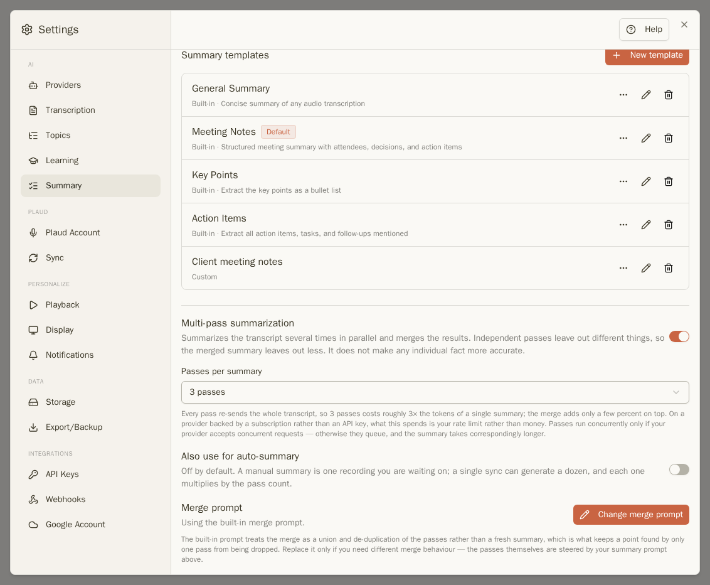
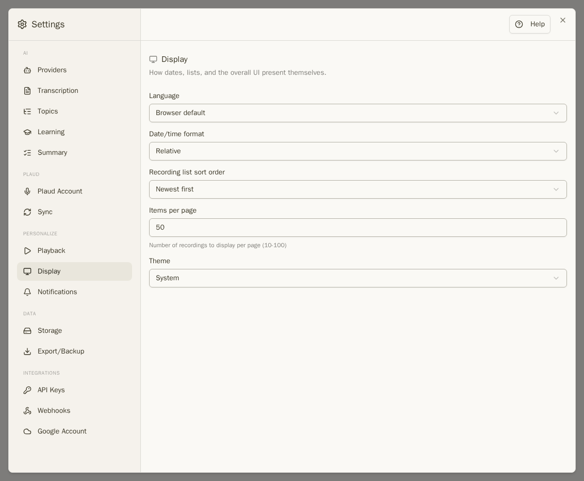

Otevřete Nastavení z nabídky účtu (kulaté tlačítko s Vaší iniciálou), nebo stiskněte `,`. Sekce jsou seskupeny vlevo.

**Nápověda** v horní části Nastavení otevře tuto příručku přímo v sekci, kterou máte otevřenou.

## Poskytovatelé AI

**Nastavení → Poskytovatelé** uvádí služby, které provádí práci AI. Klikněte na **Přidat poskytovatele**, vyberte službu, vložte její API klíč a zvolte model. Riffado nabízí přednastavení pro OpenAI, Groq, Together AI, OpenRouter, Google Gemini, ElevenLabs, Speechmatics, LM Studio a Ollama, přičemž varianta **Vlastní** přijme libovolnou službu s OpenAI-kompatibilní adresou. Klíče jsou ukládány šifrovaně a z bezpečnostních důvodů se již dále nezobrazují.

Každý poskytovatel zobrazuje svůj model, cenu a to, na které úkony se používá: **Přepis**, **Souhrny**, **Learn** nebo **Témata**. Tyto úkoly volíte v sekcích níže — každá z nich ukazuje pouze poskytovatele schopné ten daný úkol splnit.

- **Cena.** Riffado zná zveřejněné ceny běžných modelů. Pro jakýkoli jiný model, případně pokud platíte odlišnou cenu, zadejte ji zde: v dolarech za milion vstupních a výstupních tokenů nebo za hodinu audia. [Výdaj za AI](recordings.md#what-the-ai-cost) u nových požadavků použije tuto hodnotu; již zpracované náklady si zachovají původní cenu.
- **Duplikovat** (ikona kopírování) vytvoří druhého poskytovatele se stejným klíčem – například silnější model pouze pro Learn. Klíč se znovu použije, aniž by se zobrazil.
- **Claude Code** a **Codex** fungují díky předplatnému služby Claude nebo ChatGPT místo API klíče, přes můstek, který nastaví administrátor. Viz [Pro administrátory](administrators.md#claude-code-and-codex-subscriptions).

Někteří poskytovatelé zajišťují pouze přepis (ElevenLabs, Speechmatics). Pro souhrny je pak potřeba druhý poskytovatel.

## Přepis

- **Poskytovatel přepisu**: kdo provádí přepis. Viz [Jakého poskytovatele zvolit](transcripts.md#which-provider-to-choose).
- **Automaticky přepisovat nové nahrávky**: automaticky přepisovat každou novou nahrávku ihned po nahrání.
- **Importovat přepisy a souhrny Plaud**: použít přepis, který už vytvořila služba Vašeho záznamníku, místo nebo vedle přepisu od Vašeho poskytovatele.
- **Výchozí jazyk přepisu** a **Kvalita přepisu**.
- **Automaticky generovat názvy** s **Šablonami názvů**, které si můžete upravit podobně jako šablony souhrnů.

## Témata

**Automaticky detekovat témata** rozpozná témata v každém novém přepisu. **Poskytovatel témat** se ve výchozím nastavení řídí poskytovatelem souhrnů. **Šablony témat** obsahují použité instrukce.

## Učení

Zobrazuje se tam, kde je [Learn](learn.md) dostupné.

- **Poskytovatel učení** – ve výchozím nastavení shodný s poskytovatelem souhrnů. Výhodou je zde silnější model.
- **Automaticky učit**: spustit Learn na každém novém přepisu. Název, souhrn a témata zůstanou připravena k Vašemu schválení, maximálně po dobu 72 hodin.
- **Opravit přepis po Learn**: po revizi nechá Learn projít celý přepis znovu a opraví nesprávně rozpoznaná slova.

## Souhrn

- **Poskytovatel souhrnů** a **Jazyk výstupu AI**. **Auto (podle přepisu)** vytvoří souhrn ve stejném jazyce, v jakém byla nahrávka.
- **Automaticky generovat souhrn po přepisu**.
- **Šablony souhrnů**: vestavěné šablony i Vaše vlastní. Každou lze upravit; nabídka **⋯** určuje, která bude **Výchozí** nebo použitá pro automatické souhrny. **Nová šablona** umožňuje vytvořit vlastní; místo pro přepis zadejte `{transcription}`. Vestavěná šablona, kterou jste neupravili, je dále vylepšována s novoug verzí Riffado; **Obnovit vestavěné šablony** vrátí ty, které jste smazali.

- **Vícekrokové shrnutí** spustí tvorbu souhrnu 2 až 5krát a výsledky sloučí (viz [Vícekrokové souhrny](summaries-and-tasks.md#multi-pass-summaries)). **Použít i pro automatické souhrny** je samostatný přepínač, protože automatických souhrnů může být větší množství. **Upravit instrukci pro sloučení** umožňuje změnit, jak se výstupy slučují, vychází se z vestavěného textu.

## Zobrazení

**Jazyk** (English nebo Čeština), způsob zobrazení datumu, pořadí seznamu nahrávek, kolik nahrávek je na stránce a téma.

## Ostatní sekce

- **Plaud účet**: připojení, opětovné připojení či odpojení účtu záznamníku.
- **Synchronizace**: automatická synchronizace a interval jejího spouštění.
- **Přehrávání**: výchozí rychlost a hlasitost, automatické přehrání další nahrávky, zobrazení vlnového průběhu nebo ukazatele postupu.
- **Upozornění**: oznámení v prohlížeči, e-mailem nebo přes Bark na nové nahrávky.
- **Úložiště**: zabrané místo a [Automatické mazání starých dat](exports-backups-retention.md#deleting-old-data-automatically).
- **Export/záloha**: [exporty a zálohy](exports-backups-retention.md#backups).
- **API klíče** a **Webhooks**: propojení Riffado s dalšími nástroji.
- **Google účet**: propojení Google účtu používaného pro [exporty na Google Drive](exports-backups-retention.md#to-google-drive).

Dále: [Riffado v Claude](claude.md)
