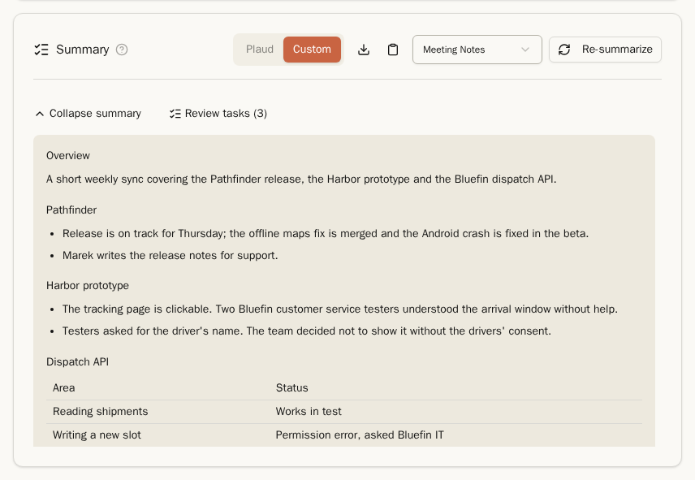
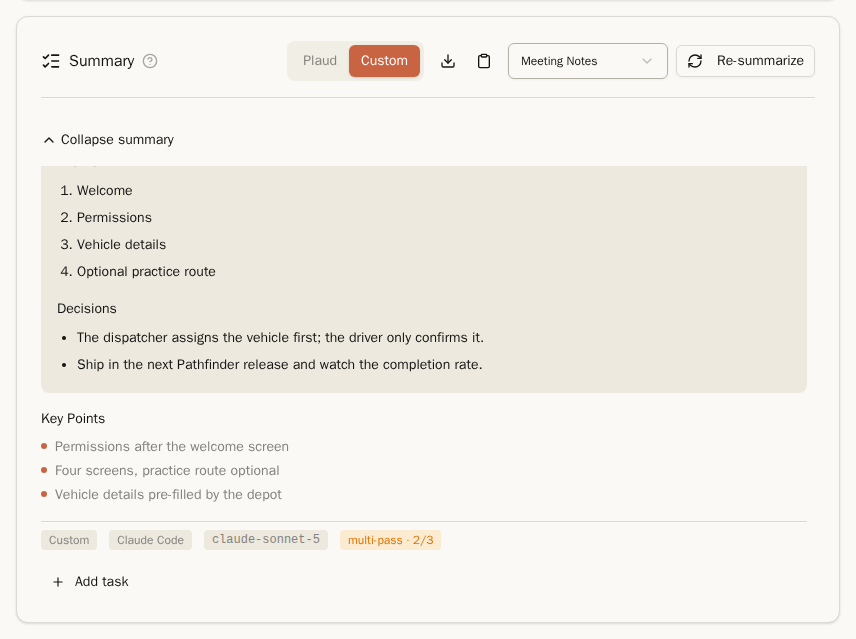
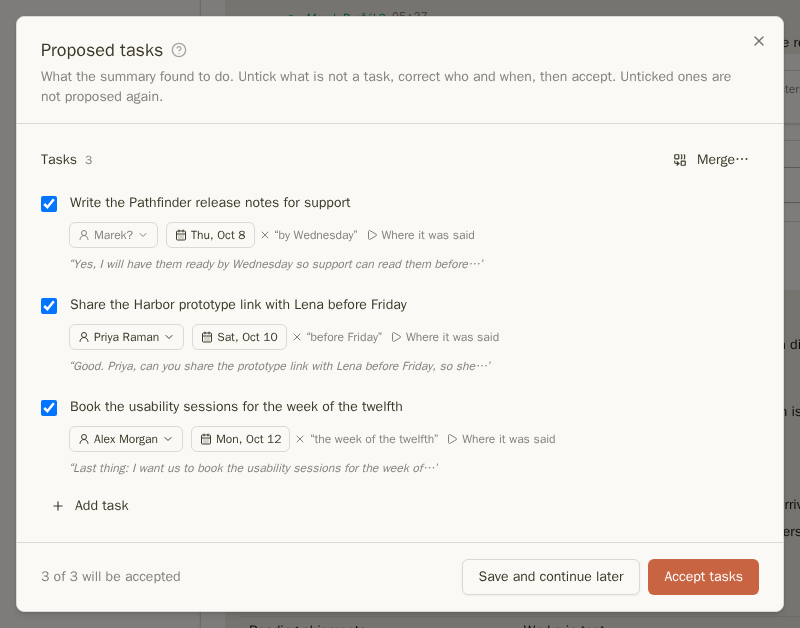
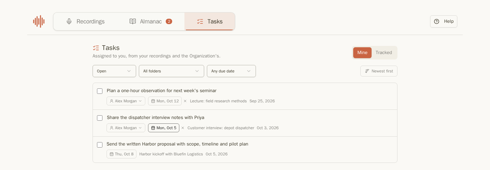
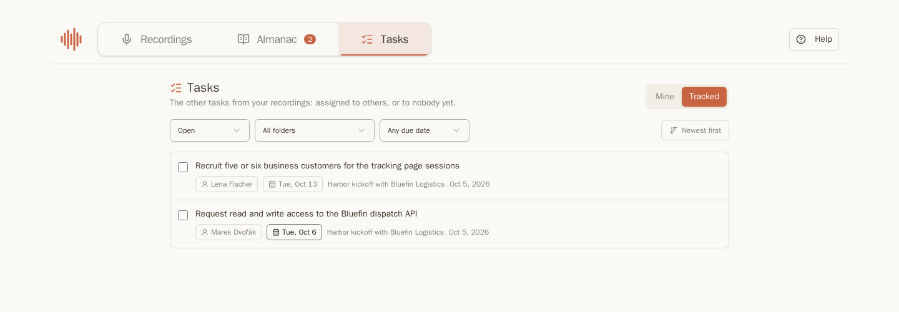

## Shrnutí

Jakmile má nahrávka přepis, karta **Shrnutí** pod ním jej může shrnout.

1. Vyberte šablonu v rozbalovacím seznamu vedle tlačítka. Výchozí je vaše základní šablona.
2. Klikněte na **Shrnout** nebo na **Znovu shrnout** pro nahrazení existujícího shrnutí.

Během zpracování karta ukazuje, jak dlouho už operace trvá a u vícekrokového shrnutí, jak daleko je: `Summarizing — 1/3 passes`, poté `Merging 3 passes…`. Můžete stránku opustit – shrnutí se nezastaví a po návratu bude připravené.

Shrnutí jsou psána ve formátu Markdown, takže nadpisy, seznamy a tabulky se tak i zobrazují. Za textem následují **Klíčové body**. Dvě ikony umožňují shrnutí zkopírovat nebo stáhnout jako Markdown soubor.

Shrnutí jsou ve stejném jazyce, jako je nahrávka, pokud si v Nastavení → Shrnutí → **Jazyk výstupu AI** nezvolíte jiný jazyk. Chcete-li automaticky shrnovat každý nový přepis, aktivujte zde možnost **Automaticky vytvořit shrnutí po přepisu**.

Pokud opravíte jména v přepisu po vytvoření shrnutí, u shrnutí se objeví upozornění **Mohou obsahovat neaktuální jména nebo pojmy** s odkazem na **Znovu vygenerovat**.

### Šablony

Šablona je instrukce, kterou dostane AI. Riffado obsahuje **Obecné shrnutí**, **Zápis z jednání**, **Klíčové body** a **Akční body** – tyto šablony můžete upravit nebo napsat vlastní v Nastavení → Shrnutí. Podrobnosti najdete v [nastavení shrnutí](settings.md#summary).

### Vícekroková shrnutí

S aktivovanou funkcí **Vícekrokové shrnutí** (Nastavení → Shrnutí) Riffado přepis shrnuje vícekrát a výsledky slučuje, takže i body zachycené jen jedním krokem se objeví ve shrnutí. Cena procesu je přibližně tolikrát vyšší, kolik kroků nastavíte.

Zápatí takového shrnutí uvádí **vícekrokové · 3**. Pokud některý krok selže a shrnutí je z méně kroků, odznak zežloutne, například **vícekrokové · 2/3**; najeďte na něj kurzorem a zobrazí se důvod.

## Úkoly ze shrnutí

Shrnutí také hledá položky, které někdo slíbil udělat. Každá taková položka se navrhne jako úkol, včetně toho, kdo jej má splnit, termínu (stanoveného na základě data nahrávky, takže „do pátku“ se přepočítá na datum) a přesné citace.

Kliknutím na **Zkontrolovat úkoly** ve shrnutí je můžete projít:

- **Odznačte** to, co není úkol. Odznačené návrhy se znovu nenavrhují pro tuto nahrávku.
- **Opravte** text, osobu nebo termín splnění. Nejprve se nabízí osoby vystupující v nahrávce, poté všichni z vašeho Almanachu. Jméno následované **?**, například **Marek?**, bylo rozpoznáno jen podle křestního jména – zkontrolujte jej.
- **Sloučit…** umožňuje spojit dva návrhy, pokud jsou to stejné úkoly. **Přidat úkol** vloží úkol, který shrnutí opomenulo.
- **Kde bylo řečeno** přehraje pasáž, kde byl úkol dohodnut.
- **Přijmout úkoly** uloží označené položky. **Uložit a pokračovat později** uchová vaše změny pro pozdější úpravy.

Shrnutí také rozpozná, pokud byl dřívější úkol splněn nebo posunut, a navrhne **Označit jako splněné** nebo nový termín splnění.

Přijaté úkoly jsou vypsané na kartě shrnutí. Zaškrtněte je po dokončení, nebo použijte **Přidat úkol** pro ruční doplnění.

## Stránka Úkoly

**Úkoly** v horní liště zobrazují úkoly ze všech vašich nahrávek.

- **Moje**: úkoly přiřazené vám. Riffado určí vaše záznamy v Almanachu podle e-mailové adresy; otevřete svůj záznam v Almanachu a zvolte **Toto jsem já**, pokud se vám zde úkoly nezobrazují.
- **Sledované**: ostatní úkoly z vašich nahrávek, přiřazené jiným osobám nebo zatím nikomu.

Filtry zobrazí otevřené, hotové nebo zrušené úkoly, úkoly z jedné složky i úkoly po termínu, splatné tento týden nebo zatím bez termínu. Seznam lze třídit podle novosti nebo termínu splnění. U každého úkolu najdete volby **Hotovo**, **Zrušit** (nebo **Obnovit**) a **Kde bylo řečeno**, což otevře nahrávku v daném okamžiku.

Pokračujte: [Almanach](almanac.md)
