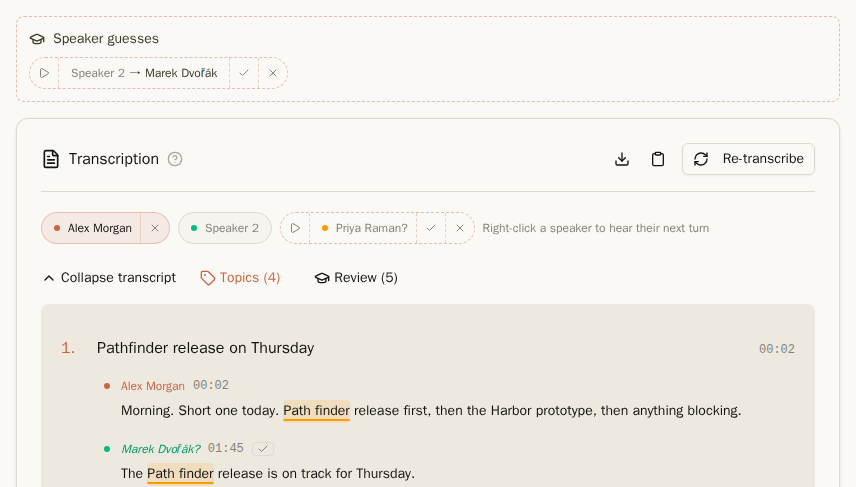
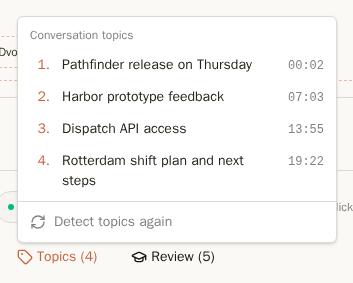
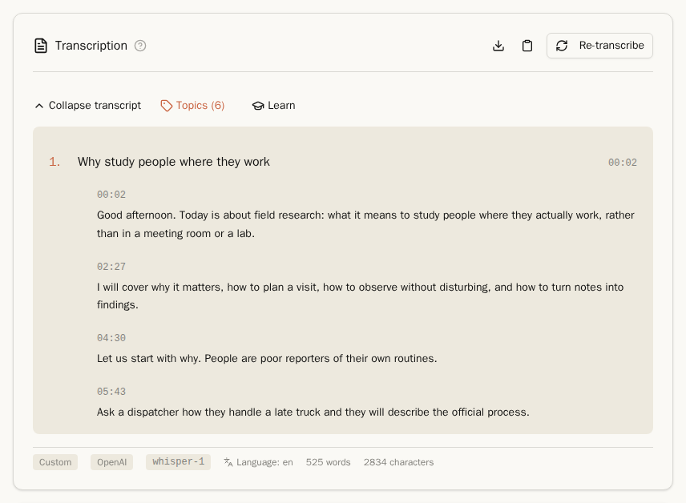
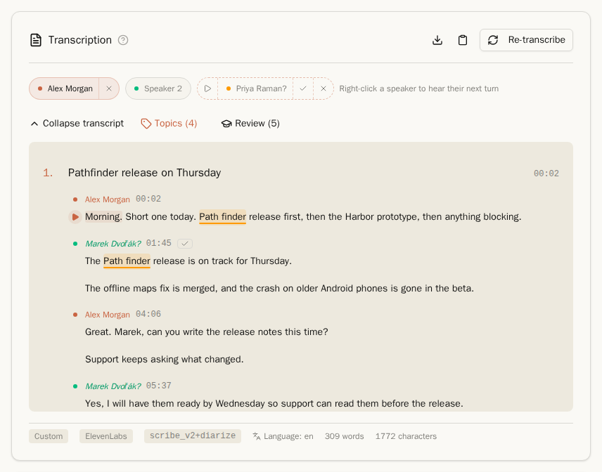
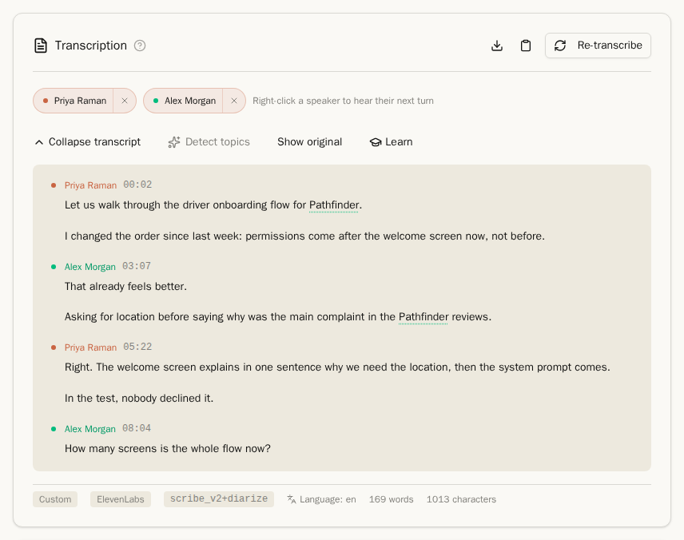
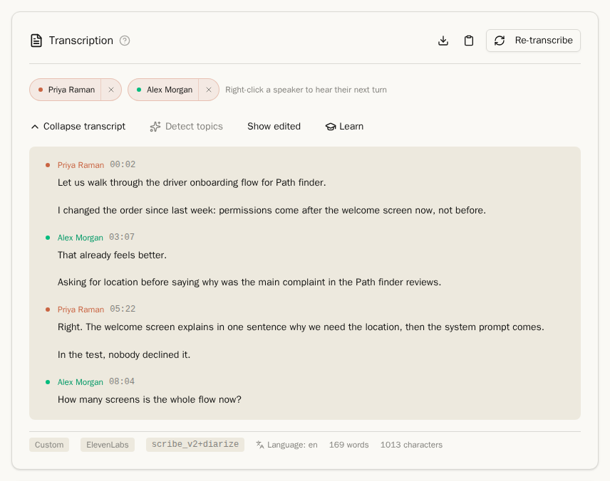

## Získání přepisu

Nahrávka bez přepisu nabízí dvě tlačítka:

- **Přepsat** odešle zvuk k vašemu poskytovateli přepisů (Nastavení → Přepis → **Poskytovatel přepisu**).
- **Přepsat v prohlížeči** spustí Whisper ve vašem prohlížeči. Je to zdarma a nic neopustí váš počítač, ale je to pomalejší.

**Znovu přepsat** u nahrávky, která už má přepis, spustí přepis s vaším aktuálním poskytovatelem. Jména mluvčích, která jste zadali, jsou předána do nového přepisu jako návrhy, které potvrdíte jedním kliknutím.

S nastavením **Automaticky přepisovat nové nahrávky** (Nastavení → Přepis) je každá nová nahrávka přepsána hned po nahrání.

### Jakého poskytovatele zvolit

Funguje jakákoli služba, která podporuje OpenAI API, a další tři jsou zabudované. Vaše volba určuje, co získáte:

| Poskytovatel | Rozlišení mluvčích | Časování | Poznámky |
| --- | --- | --- | --- |
| ElevenLabs Scribe (**označení mluvčích**) | Ano | Ano | Rozpoznává jména z vašeho Almanachu. |
| Speechmatics (**označení mluvčích**) | Ano | Ano | Rozpoznává jména z vašeho Almanachu. `melia-1` zvládne více jazyků v jedné nahrávce. |
| OpenAI `gpt-4o-transcribe-diarize` | Ano | Ano | |
| OpenAI `whisper-1`, Groq, místní Whisper | Ne | Ano | Dlouhé projevy se dělí do odstavců. |
| OpenAI `gpt-4o-transcribe`, Google Gemini | Dle případu | Ne | |

**Na časování záleží.** Témata, Learn, přehrávání jedné věty a navigace v přepisu vyžadují informaci o tom, kdy byla která replika řečena. Přepis bez časování se zobrazí jako prostý text.

**Jména z Almanachu.** ElevenLabs Scribe v2 a Speechmatics dostanou s každou nahrávkou až 500 jmen z vašeho [Almanachu](almanac.md): nejprve vaše, pak osoby a věci zmíněné nedávno. Jména pak napíšou správně mnohem častěji. Jména jsou odesílána u každé nahrávky, včetně osob, jež se v ní nevyskytují.

**Přepisy z diktafonu.** Pokud služba vašeho diktafonu vytvořila vlastní přepis a shrnutí, Riffado je dokáže importovat (Nastavení → Přepis → **Importovat přepisy a shrnutí Plaud**). Nahrávka, která má oba, zobrazí přepínač mezi **Plaud** a **Vlastní**.

## Čtení přepisu

Přepis s mluvčími je čten jako rozhovor, každý příspěvek je barevně odlišený blok se jménem mluvčího a časem začátku. **Sbalit přepis** skryje přepis. V zápatí vidíte, který poskytovatel a model jej vytvořil, v jakém jazyce a jak je dlouhý.

### Pojmenování mluvčích

Štítky nad přepisem představují mluvčí.

- Klikněte na štítek, například **Mluvčí 2**, a vyberte, kdo to je, ze svého [Almanachu](almanac.md), vytvořte novou osobu nebo označte mluvčího jako **Neznámý**.
- Přerušovaný štítek končící na **?**, například **Priya Raman?**, je návrh. Klikněte na **✓** pro potvrzení nebo **×** pro odmítnutí; odmítnuté jméno již nebude tomuto mluvčímu nabídnuto. **▷** přehraje okamžik, na jehož základě návrh vznikl.
- **Hádaní mluvčích** nad přepisem jsou návrhy Learn. Viz [Learn](learn.md).
- Pravým tlačítkem myši na štítek přehrajete další výstup daného mluvčího.

Zadaná jména se zobrazují všude tam, kde vystupuje přepis: ve shrnutí, exportech, zkopírovaném Markdown i v API.

### Témata

**Témata** rozdělí dlouhý přepis do kapitol s názvem. Kliknutím na **Detekovat témata** se témata vytvoří; výběrem tématu v nabídce **Témata** tam přepíš přeskočí: přepis se posune na nadpis a přehrávač na jeho začátek. Zapnutím **Automaticky detekovat témata** v Nastavení → Témata se budou témata rozpoznávat automaticky u každého nového přepisu.

### Dlouhé projevy

Přednáška nebo dlouhý monolog se rozdělí do odstavců zhruba po půl minutě – na konci věty a vždy, když začíná nové téma. Každý odstavec ukazuje čas začátku.

## Přehrávání z přepisu

- **Klikněte na větu** a nahrávka se od ní přehraje. Opětovným kliknutím přehrávání pozastavíte.
- **Klikněte na časový údaj,** čímž přesunete přehrávač na danou pozici bez spuštění přehrávání.
- **Při přehrávání** je právě mluvená věta zvýrazněna a přepis se automaticky posouvá. Pokud přepis posouváte sami, přehrávání se přesune na větu, na které se nacházíte.

## Opravená slova

Pokud Learn opravila špatně rozpoznané jméno, přepis jej zobrazuje již opravené. Opravená slova jsou podtržená.

| Opraveno | Původní |
| --- | --- |
|  |  |

- **Zobrazit původní** ukáže, co slyšel poskytovatel; **Zobrazit upravené** přepne zpět.
- Klikněte na opravené slovo a zrušíte tuto jednu opravu.
- Shrnutí, témata, vyhledávání, exporty i API vždy využívají opravený text.

Viz [Learn](learn.md), kde vznikají opravy.

## Kopírování a stahování

Dvě ikony vpravo nahoře u přepisu umožní přepis zkopírovat do schránky nebo stáhnout jako Markdown soubor, se jmény mluvčích a zapracovanými opravami. Shrnutí obsahuje stejné dvě ikony.

Další: [Shrnutí a úkoly](summaries-and-tasks.md)
